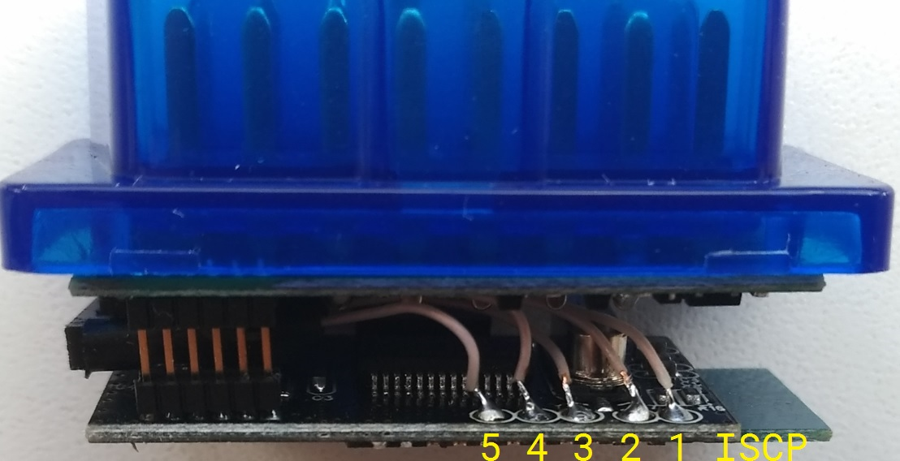
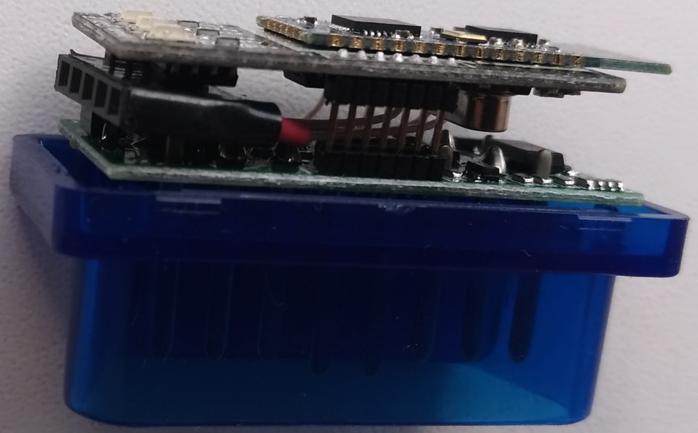
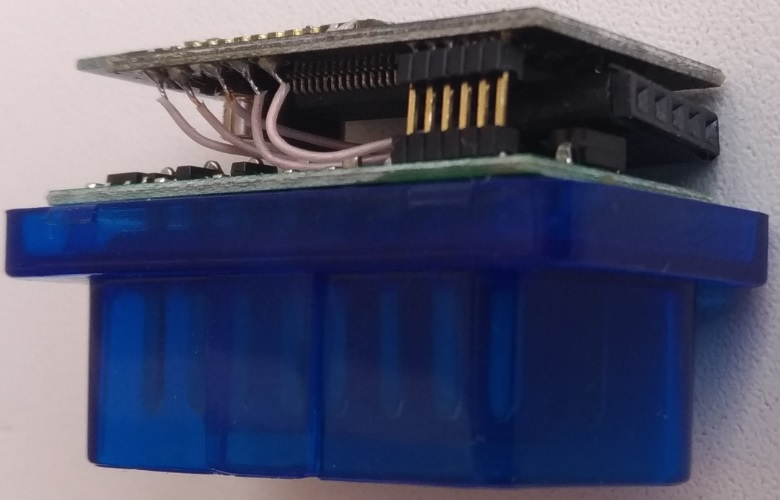

#### PIC Bootloader for ELM327SLCAN

This bootloader was designed for wireless (bluetooth) firmware downloading to the [ELM327SLCAN](https://github.com/qnx425/ELM327SLCAN) device. It is based on [Microchip AN1310](https://www.microchip.com/wwwAppNotes/AppNotes.aspx?appnote=en546974).

##### Development cycle.

- Buy the cheap ELM327 based on PIC18F25K80. Based on PIC18F25K80 only! I’m using ELM327 mini.
- Modify hardware. Solder the 5-pin ICSP connector. The first ICSP pin is on the corner of the board. 
- Power the ELM327. +12V – pin 16, GND – pin 4.
- Connect the PICkit2 or PICkit3 to the new connector. Erase the PIC18F25K80 and flash the bootloader firmware.

Bootloader works on 38400 bps. This speed is set by the bluetooth module, which is not HC-05 or HC-06. I couldn’t set a higher speed.

See also [ELM327 hacking](https://area515.org/elm327-hacking/).

